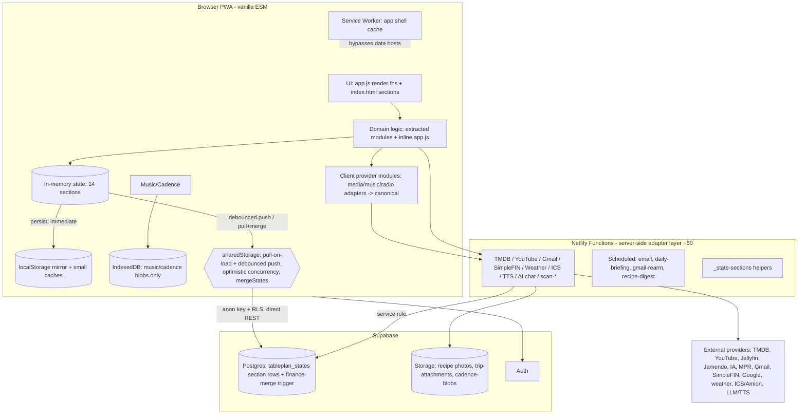

# Architecture & Reliability Audit — "Live"

*Read-only assessment. No application code, schema, config, dependencies, or infrastructure were modified. Working tree is clean; 719 unit tests green and production build succeeds as of this audit (2026-08-25). Evidence is cited as `file:function` / `file:line`; where the DB is involved I inspected code only (no SQL was run).*

---

## 1. Executive Summary

**Live is a vanilla-ESM PWA with no UI framework**: one ~55k-line `app.js` monolith rendering every page, backed by ~60 extracted ES modules, ~60 Netlify functions (the server-side integration layer), a local dev server, Vite/Vitest, CI, a service worker, and Supabase (Postgres for state + Storage buckets + Auth).

The headline finding is that **the architecture is substantially healthier than a 55k-line monolith suggests, and is already closer to your target direction than expected** — but that quality is *unevenly distributed*:

- **The Media and Music/Cadence domains are exemplary** and already implement the exact `Provider → Adapter → Canonical model → domain logic → UI` pattern you want, with capability-based provider registries, a Playback Coordinator, canonical models with stable IDs, and (for Music) IndexedDB blob storage with metadata synced separately. These are the templates for everything else.
- **State/persistence/sync is a genuinely good foundation**: a single in-memory `state` split into 14 domains, mirrored to `localStorage` on every change (so the app boots and runs offline from last-known data), and synced to Supabase as canonical truth via **section-granular, change-detected, optimistically-concurrent writes** with `mergeStates` (union-by-id + tombstones) and a **server-side schema-version trigger** guarding finance. There is **no realtime and no polling of the database** — sync is pull-on-load + debounced push.
- **The weak half is the app.js-embedded domains** — Finance, Inventory, Recipes, Meal Plan, Health, Contacts, Tasks, Shopping — which have inline (not modularized) logic, few or no canonical model modules, and **little or no test coverage** (Finance and Inventory have *zero* tests despite Finance being large, sensitive, and having a prior data-loss incident).

You are **not** far from local-first, cross-domain context, and an AI-on-top-of-facts architecture. The work is **consolidation and propagation of patterns you already have**, not a rewrite. The two things that most deserve attention before further expansion are (1) the **large, hot Media state section** driving Supabase egress/disk-IO, and (2) **test coverage for the untested high-risk domains** (Finance first).

**This is not a rewrite candidate.** It's a codebase that has already discovered its own good patterns in the newest domains and needs to extend them inward.

---

## 2. Current Architecture

**Stack.** Vanilla ES modules, no framework. `index.html` declares every "page" as a hidden `<section>`; navigation toggles visibility and calls `render*` functions in `app.js`. Vite builds `dist/`; deploy is Netlify (functions + static). Local dev runs `server.js` (port 4175) + Vite (4174) via `dev.sh`.

**Layers (as they actually exist):**

| Layer | Where it lives | State of health |
|---|---|---|
| **UI / rendering** | `app.js` `render*` functions + `index.html` sections + `styles.css` | Monolithic but consistent; string-template DOM rendering, no component system |
| **Domain logic** | *Split*: extracted modules (`media-*`, `music-*`/Cadence, `calendar/*`, `travel-*`, `grocery-*`, `nutrition-*`, `food-health*`, `receipt-*`, `radio*`, `playback-*`, `state-sync`, `tasks-overlay`, `media-search-scope`) **vs.** inline in `app.js` (finance, inventory, recipes, eat/meal-plan, health, contacts, tasks, watch, shopping) | Extracted half is clean + tested; inline half is not |
| **State** | One in-memory `const state` (`app.js:250`), `defaultState()`/`normalizeState()`, 14 sections (`STATE_SECTIONS`) | Well-structured, single source in memory |
| **Persistence** | `localStorage` mirror + `IndexedDB` (music/cadence blobs only) + Supabase Postgres `tableplan_states` (section rows) + Supabase Storage buckets | Coherent, layered, see §5 |
| **Sync** | `sharedStorageProviders()` → `hydrateStateFromSharedStorage()` (pull+merge) / `writeStateToSupabase()` (push); `mergeStates` in `state-sync.js` | Solid; no realtime; section-granular |
| **External providers** | ~60 Netlify functions (secrets server-side) + client provider modules that normalize to canonical | Excellent for Media/Music; ad hoc elsewhere |
| **Auth** | Supabase Auth; anon key in client (RLS-gated); functions validate the caller's access token then use service-role | Standard, correct pattern |
| **Background** | Netlify scheduled functions (email `*/15`, daily-briefing, gmail-watch-rearm, recipe-digest) + web push + in-app `setInterval`s | Reasonable; see §7 |
| **PWA / offline** | `sw.js` (network-first navigation, stale-while-revalidate assets, data hosts bypassed), `manifest.json` | App-shell offline yes; data offline via localStorage mirror |

**Routing/nav.** Hash-based route map (`app.js` `{ schedule: showPlanApp, settings: showSettingsApp, … }`) + `show*App()` functions that set `activeAppArea`, hide all pages, show one, and render. Page enablement gated by `isPageEnabled` / `isPagePersonallyEnabled` (admin/group/personal disable).

---

## 3. Architecture Diagram

**Conceptual flow that matters:** `External provider → Netlify function (adapter, holds secrets) → canonical model → in-memory state → localStorage mirror (offline truth) → Supabase section row (cloud truth) → merge on next load`.

---

## 4. Domain / State Ownership Matrix

Every domain's canonical runtime home is the single in-memory `state` object; the questions are *what is authoritative*, *what is cache*, and *what is external*. Classifications are derived from `STATE_SECTIONS`, the section scope map (`SECTION_SCOPE`), and the persistence path.

| Domain | State section | Originates | Canonical (truth) | Cache | Remote/external | Classification |
|---|---|---|---|---|---|---|
| **Calendar (local events)** | `plan.planEvents` | user | in-memory → Supabase row | localStorage | — | **Local-first-capable** (hybrid today) |
| **Calendar (subscriptions)** | `plan.planCalendars` (ICS/Amion), `plan.calendars` (Google) | external feeds | feed is source; app stores refs + cache | `live_plan_ics_cache` (localStorage) | ICS/Amion/Google | **External source, locally cacheable** |
| **Tasks** | `do.*` (doPlans/doBacklog/recurringTasks) | user | in-memory → Supabase | localStorage | — | **Local-first-capable** |
| **Shopping** | `grocery.*` (25 keys) | user + derived from meal plan | in-memory → Supabase | localStorage | store catalogs (grocery-catalog) local | **Local-first-capable** |
| **Inventory** | `inventory.*` | user | in-memory → Supabase | localStorage | — | **Local-first-capable** |
| **Recipes** | `eat.recipes` + Storage photos | user + import functions | in-memory → Supabase; photos in bucket | localStorage | import/scan functions (network) | **Local-capable, remote-dependent for import** |
| **Meal plans** | `eat.plans/publishedWeeks` | user | in-memory → Supabase | localStorage | — | **Local-first-capable** |
| **Media (library/progress)** | `media.*` (40+ keys: savedArticles text, podcastProgress, musicLibrary, mediaHistory) | user + providers | in-memory → Supabase (**large hot row**) | localStorage | TMDB/YouTube/IA/podcast feeds | **Hybrid; personal data local-capable, catalog external** |
| **Playback state** | `media.podcastProgress` etc.; live position in memory (`playback-engine`) | runtime | in-memory; persisted progress in section | — | stream hosts | **Hybrid** (live is ephemeral, progress synced) |
| **Weather** | `config.weatherLocations` + `weather-cache.js` | user picks location; data external | location local; readings external | in-memory cache | weather function | **External, cacheable** |
| **Finance** | `finance.*` (27 keys) | SimpleFIN + user annotations | in-memory → Supabase (schemaVersion-guarded) | localStorage | SimpleFIN (bank) | **External source + local annotations; sync-guarded** |
| **Music / Cadence** | `cadence.*` (metadata) + `recreate.pianoSongs` | user + import/OMR | metadata → Supabase; **bytes in bucket + IndexedDB** | IndexedDB (`live-music`) | — | **Local-first (best in class)** |
| **Settings** | `config.*` | user | in-memory → Supabase | localStorage | — | **Local-first-capable** |
| **Contacts** | `contacts.*` | user + import | in-memory → Supabase | localStorage | Google import | **Local-first-capable** |
| **Health** | `health.*` | user | in-memory → Supabase | localStorage | nutrition estimate function | **Local-capable** |
| **Travel** | `travel.*` + Storage attachments | user + ingest functions | in-memory → Supabase; extra `tableplan-trips-v1` localStorage backup | localStorage | ingest/geo/time functions | **Local-capable, remote-dependent for ingest** |

**Scope model (`SECTION_SCOPE`):** sections are `household`, `personal`, or `toggle`-able; the loader (`loadStateFromSupabase`) fetches active rows + inactive "shadow" rows so a section can flip scope without data loss. This is a real multi-user/household model, already built.

**Key point for your local-first goal:** *almost every personal domain is already local-first-capable* — the truth lives in one in-memory object mirrored to localStorage; Supabase is the durable/shared copy. The label "hybrid" applies today only because the boot narrative treats Supabase as "the truth" (`app.js:3123` comment) and because large sections lean on localStorage.

---

## 5. Persistence Map

| Mechanism | Stores | Canonical? | Survives reload? | Survives offline? | Disagreement risk |
|---|---|---|---|---|---|
| **In-memory `state`** | everything, live | working copy | no | n/a | — |
| **localStorage `STORAGE_KEY` mirror** | full serialized `state` | **bootstrap/offline truth** | yes | yes | vs. Supabase → resolved by `mergeStates` on load |
| **localStorage caches/flags** | `live_plan_ics_cache`, `live_watch_search_scope`, `SCOPE_PREFS_KEY`, `tableplan-trips-v1` (trip backup), `cadence-view-mode/zoom`, push/dev flags | cache/prefs | yes | yes | low |
| **IndexedDB `live-music`** | music/cadence blob bytes (scores/audio) | local cache of bucket bytes | yes | yes | low (bucket is truth) |
| **Supabase Postgres `tableplan_states`** | 14 section rows per scope (household/personal) | **cloud truth** | yes | n/a | optimistic-concurrency + merge trigger |
| **Supabase Storage buckets** | recipe photos, trip-attachments, cadence-blobs | truth for binaries | yes | n/a | low |
| **Service-worker cache `live-vNN`** | app shell + static assets (not audio, not data hosts) | cache only | yes | yes | low (versioned) |
| **Server-side** | Gmail tokens, SimpleFIN, provider caches (in functions) | provider-side | n/a | n/a | — |

**Duplicated persistence of the same conceptual data (the `UI → remote → cache → UI` risk you flagged):**
- **The full-state mirror is the intended design, not a smell** — `persist()` writes localStorage immediately then debounces the Supabase push; `mergeStates` reconciles on load. This is a deliberate offline cache, and it's fine.
- **Real duplication:** `travel` data is persisted **twice** locally — inside the state mirror *and* a separate `tableplan-trips-v1` backup (`saveTripBackup`). Minor, defensible (belt-and-suspenders after a past trip-loss), but it's two sources that can disagree.
- **Size risk (Important):** the localStorage mirror holds *everything*, including the large `media` section (full `savedArticles` text + `musicLibrary` + all podcast data). localStorage is synchronous and quota-limited (~5–10 MB); you can already see defensive `catch { /* full */ }` around scope-pref writes. As media/finance grow, the mirror risks quota errors and main-thread jank. Music already solved this by using IndexedDB for blobs — the same move applies to large text sections.

---

## 6. Network Dependency Map

> "If the network disappeared right now, what would keep working?"

**Would keep working (data already in-memory/localStorage; shell cached after first visit):** Calendar (local events), Tasks, Shopping list, Inventory, Recipes (view/edit; not import), Meal plans, Finance (view existing; not refresh), Health, Contacts, Settings, Media *library & progress* (view/track; not search/stream), Cadence (cached scores). This is a large surface — **the app is meaningfully usable offline today** for personal data, provided it has loaded once.

**Would break offline:** first-ever load (app bundle isn't precached — `PRECACHE` is only `/` + favicon in `sw.js`); all provider *search/fetch* (TMDB, YouTube, Jellyfin, IA, Jamendo, radio, article fetch); weather; SimpleFIN refresh; Gmail; calendar subscription refresh; TTS/AI; map tiles.

**Classification:**

| Category | Domains/operations |
|---|---|
| **A — Fundamentally external** | live weather, media catalogs/search (TMDB/YouTube/IA/Jamendo), radio streams, bank (SimpleFIN), Gmail, LLM/TTS, map tiles, Google Places |
| **B — External source, locally cacheable** | calendar subscriptions (ICS/Amion/Google), weather readings, media metadata, saved articles, holidays, showtimes |
| **C — Personal data that should be (and largely already is) local-first** | Tasks, Shopping, Inventory, Recipes, Meal plans, Settings, Calendar local events, media *progress*, Cadence metadata, Finance annotations, Health, Contacts |

The gap between "C should be local-first" and today is **small** — mostly (a) precaching the bundle, (b) moving large sections off synchronous localStorage, and (c) reframing sync as "local is truth, cloud is a replica" rather than the reverse.

---

## 7. Database / Supabase Findings

The state R/W path (`writeStateToSupabase` → `writeSectionWithMerge`, `loadStateFromSupabase`) is **well-engineered**: one fetch loads all section rows; writes are **per-section, change-detected** (`lastWrittenSections[section] !== currentJson`), **debounced**, use **optimistic concurrency** (`PATCH … updated_at=eq.<seen>`, 0-rows ⇒ conflict-merge-retry), are **guarded by a `schemaVersion` + `tp_protect_finance_merge` DB trigger**, and there is **no realtime and no DB polling**. Good.

**Critical**
- **The `media` section is a large, hot row rewritten in full on small interactions.** `STATE_SECTIONS.media` has 40+ keys including `savedArticles` (**full article text**), `musicLibrary`, `mediaHistory`, and all podcast data. Any media interaction that marks a key dirty (e.g. `readArticleIds`, `podcastProgress`, history) forces a rewrite of the **entire** media section row. Egress/disk-IO ∝ (section size × write frequency); article text makes the size large and podcast progress makes the frequency high — this matches the documented disk-IO/egress incident. **This is the single most important DB issue.**

**Important**
- **High-frequency small writes bundled with heavy data.** `podcastProgress` updates (playback ticks) and `mediaHistory` live in the same big section as article text, so cheap frequent updates carry an expensive payload. Same anti-pattern in a smaller form anywhere a hot key shares a section with bulky keys.
- **`persist()` fan-out.** Every `persist()` clears caches, writes the full localStorage mirror, writes the trip backup, and schedules a cloud push. For very frequent updates this is a lot of synchronous serialization of the whole state per change (see §5 size risk).

**Minor**
- **Probe-before-insert** in `writeSectionWithMerge` (an extra GET when no stamp is known) — only on first write per section per load; negligible.
- **ICS background refresh is dev-only** (`setInterval(… if (!canUseLocalBackend()) return … fetchAllPlanCalendars, 15min)`) — subscribed calendars don't auto-refresh in production. (The Calendar work already made prod fetch *possible* via `ics-proxy`; the periodic trigger is still gated to dev.)
- **Direct client REST to `/rest/v1/tableplan_states`** means **RLS is the sole authorization** for state reads/writes (see §16).

---

## 8. Provider / Adapter Findings

**Well isolated (keep and propagate):**
- **Media** — `media-provider.js` (capability registry: `MEDIA_CAP`, `PROVIDER_CATALOG`, `makeProvider`, `hasCapability`), adapters `media-provider-{tmdb,jellyfin,youtube,music,radio,podcast}.js`, normalization in `media-search.js`/`media-sources.js`, and the **Playback Coordinator** (`playback-coordinator.js`) choosing targets by capability. Provider specifics stay behind `providerRefs` on the canonical `MediaItem`. This is textbook `Provider → Adapter → Canonical → logic → UI`.
- **Music/Cadence** — `music-provider-{internetarchive,jamendo}.js`, `music-source-resolver.js`, `music-library.js` (pluggable sources + memory/IndexedDB stores), `music-canonical.js` (rich metadata extraction). Same pattern, plus local blob storage.
- **Radio** — `radio-provider-{mpr,radiobrowser,user}.js` behind a common shape.
- **Calendar (partial)** — `calendar/{sources,normalize,reconcile}.js` give external events stable identity (`sourceId:externalId`) + reconcile; ICS parser extracted to `calendar/ics.mjs`. Amion is already a registered provider reusing the ICS pipeline.

**Not yet isolated / leaking into `app.js`:**
- **Gmail, SimpleFIN (finance), Google (calendar/places/birthdays), weather** are properly server-side (functions), but their **client consumption is inline in `app.js`** with provider-shaped data threaded directly into rendering and state, rather than normalized through a canonical model. Finance especially couples SimpleFIN transaction shapes into `app.js` finance logic.
- **Two calendar list shapes remain** (`state.calendars` = Google shape, `state.planCalendars` = generic ICS/Amion shape). The *management UI* was unified, but the two data models still coexist — a partial migration.

**Net:** the adapter pattern is proven and loved in Media/Music; the opportunity is to apply it to the remaining external integrations (Finance/SimpleFIN and Calendar-sources are the highest value, and both have planned work).

---

## 9. Canonical Model Findings

| Entity | Canonical model | Stable IDs | Provider leakage | Sync-ready | Notes |
|---|---|---|---|---|---|
| **MediaItem / Progress / ProviderRef / PlaybackTarget** | `media-model.js` (`makeMediaItem`, `makeProgress`, `mediaKey`, `contentKey`) | yes (`kind:id`, `contentKey` via TMDB) | isolated behind `providerRefs` | yes | **Gold standard** |
| **Music Track / Work** | `music-library.js` `makeTrack`, `music-canonical.js` | yes (`uid`) | isolated | yes | Excellent; blobs separate |
| **CalendarEvent** | `calendar/model.js` `normalizePlanEvents` + `calendar/normalize.js` external identity | yes (+ `sourceId:externalId`) | mostly isolated (two subscription shapes) | yes | Strong after Calendar 2.0 |
| **Task** | inline `normalizeDoTasks` in `app.js`; `tasks-overlay.js` for week session | yes (`createId("task")`) | n/a | yes (union+tombstones) | Model is inline, no module/tests beyond overlay |
| **ShoppingItem / Grocery** | `grocery-catalog.js` + `grocery-sources.js`; much inline | partial | store catalogs isolated | yes | Mixed |
| **InventoryItem** | inline in `app.js` | yes | n/a | yes | No module, no tests |
| **Recipe** | inline; import via `recipe-scan`/`import-recipe` | yes | import shapes isolated in functions | yes | No dedicated model tests |
| **FinanceTxn / Account / Budget** | inline in `app.js` (27 keys) | yes | **SimpleFIN shape leaks in** | yes (schemaVersion-guarded) | **Largest un-modeled, un-tested surface** |
| **Contact** | inline | yes | Google import isolated in function | yes | No tests |

**Cadence lessons worth sharing app-wide** (explicitly requested; do **not** expand Cadence):
1. **Canonical metadata as small id-keyed collections synced in a section row; heavy bytes out-of-band** (bucket + IndexedDB). This is precisely the split every large domain needs — and it directly solves the §7 Media-section problem (article *text* is Cadence's "bytes").
2. **Pluggable source abstraction** (`createMusicLibrary({ sources })`) with a memory store for tests and an IndexedDB store for production — so the domain is fully testable without a browser.
3. **A domain-specific canonical parser** (`music-canonical.js`) that turns messy external titles into structured facts deterministically — the same "app determines truth" principle §13 wants.
4. **Heavy test investment on the pure model** (~30 test files) makes the domain safe to evolve.

---

## 10. Offline-First Readiness

**Can the app open and be useful with no network today?** **Partially yes** — after at least one online load (so the SW has cached the shell/assets and localStorage holds the mirror), the app opens and all personal-data domains work read/write; changes queue and flush on reconnect (`writeStateToSharedStorage` retries with backoff; `handleCameOnline` re-flushes). **First-ever load offline fails** because the bundle isn't precached.

| Domain | Offline readiness | Why |
|---|---|---|
| Tasks, Shopping, Inventory, Meal plans, Settings, Contacts, Health, Calendar (local events) | **Easy / already works** | in-memory + localStorage mirror; no provider dependency |
| Recipes | **Easy (view/edit)** | data local; only import needs network |
| Finance | **Easy (view), external (refresh)** | annotations local; balances need SimpleFIN |
| Media progress / library | **Works, but size-fragile** | in localStorage today; should move large parts to IndexedDB |
| Cadence | **Best** | IndexedDB blobs + metadata |
| Calendar subscriptions, Weather, Media search/stream | **External** | provider-driven |

**To become *genuinely* local-first (do NOT implement now):** (1) precache the built bundle in the SW (turn the shell cache into an offline-complete app), (2) migrate large sections' local mirror to IndexedDB (async, higher quota), (3) add explicit offline UX/stale-badges for provider-dependent views, (4) reframe the mental model to "local is canonical, cloud is a replica" (the code already behaves this way; the framing and conflict story should be made explicit).

---

## 11. Synchronization Readiness

The building blocks are already present: **stable IDs everywhere**, **tombstones** (`state.tombstones`, `mergeTombstones`), **`stateUpdatedAt` + per-row `updated_at` stamps**, **`schemaVersion`**, **union-by-id merge** (`state-sync.js` `unionById`/`unionStrings`/`unionByKey`), **optimistic concurrency**, and **source attribution for external events** (`sourceId:externalId`). What's *absent* is a per-record revision/oplog and field-level conflict resolution — merges are last-writer-wins at the record level (newer `updatedAt` wins), union at the collection level.

| Domain | Sync difficulty | Why |
|---|---|---|
| Tasks, Inventory, Contacts, Settings, Health, Meal plans | **Easy** | id-keyed collections + tombstones already union cleanly |
| Shopping | **Easy–Moderate** | many derived/ephemeral keys (checked, cleared) that need clear ownership rules |
| Calendar local events | **Easy** | id-keyed + recurrence handled |
| Media | **Moderate** | needs the large-row split first; then progress vs library have different update cadences |
| Finance | **Moderate** | already needs the schemaVersion trigger to prevent stale-wipe; multi-device edits to the same annotation are last-writer |
| Recipes | **Easy** | id-keyed; photos already in buckets |
| Cadence | **Easy (metadata)** / **External (bytes)** | metadata unions; bytes are content-addressed in bucket |
| Calendar subscriptions, Weather | **External** | provider-driven, cache-only |

**Verdict:** the app is **already "sync-ready" for most domains** via the section/union/tombstone model. The realistic upgrade path is *not* CRDTs; it's (a) documenting the last-writer boundary, (b) field-level merge only where genuinely needed (Finance annotations), and (c) fixing the large-row issue so Media sync is cheap.

---

## 12. Shared Infrastructure Opportunities

Genuinely duplicated implementations found:
- **Drag / reorder / touch-drag** — ~85 drag-related handler sites in `app.js` (`dragstart`/`dragover`/`drop`, `data-*-drop-day`, plus an `initTouchDragPolyfill`). Tasks, meal entries, play/exercise, watch, and grocery each implement their own. **This is the strongest case for a single shared interaction primitive** — and it aligns exactly with your planned Shop/Shopping-List/Media-Queue interaction work.
- **Provider normalization** — clean in Media/Music, ad hoc elsewhere; a shared "adapter → canonical" helper would reduce per-integration boilerplate.
- **Caching** — several bespoke caches (`planRangeCache`, `weather-cache.js`, `planCalendarCache`, media hub cache); a small shared cache utility (TTL + invalidation) could unify them.
- **Loading/error/empty states, date/time handling, notifications, search/filter** — implemented per-feature; opportunities exist but are lower priority than drag and provider normalization.

**Recommendation (design-now):** one **reorderable-list interaction primitive** (pointer + touch + auto-scroll + keyboard + a11y) that the planned interaction work builds *once* and Shop/Shopping List/Media Queue consume. Do not retrofit every list at once.

---

## 13. Today / Context Engine Readiness

**Good news: the hard part is already done.** All personal-domain facts live in one in-memory `state` object with stable IDs, and several domains expose clean projection helpers (`getPlanEventsForRange` for calendar, `doOverdueDayTasks`/`doDueTimedTasks` for tasks, weather cache, meal-plan selectors, media history/continue). A deterministic Context/Projection layer is **feasible without any new persistence and without AI**.

| Domain | Exposes clean data for context? | Gap |
|---|---|---|
| Calendar | **Yes** — `getPlanEventsForRange(start,end)` already projects merged local+external+task events | none |
| Tasks | **Yes** — `doOverdueDayTasks`, `doDueTimedTasks`, `doUnfinishedChores` (today-relative, `doRealWeekKey`) | none |
| Weather | **Yes** — cache + active location | network for fresh |
| Meal plan | **Mostly** — selectors exist but entangled with `currentWeek` | needs a today-scoped read that doesn't depend on browsed week |
| Shopping | **Mostly** — data is in `state`, but "what's missing" logic is UI-embedded | extract a pure "outstanding items" selector |
| Inventory | **Partially** — data present, no query API | add read selectors |
| Media | **Yes** — continue/recent/saved via `media-state.js` | none |
| Finance | **Partially** — facts present, logic inline | add read selectors |

**Recommendation (design-now, implement-later):** define a **read-only projection API per domain** (`domain.projectToday(state, now) → facts`) — pure functions, unit-testable, no side effects — and a thin **Context engine** that composes them into a `TodayContext` object. Home becomes an **orchestration/projection layer** over these, owning no data. This is a natural extension of the extraction pattern you already use, and it's the prerequisite for §14.

---

## 14. AI Boundary

The architecture **already supports "the app determines truth; AI interprets it"** — and mostly follows it. AI lives in server functions (`chat.js`, `voice-command.js`, `daily-briefing.js`, `weekly-review.js`, `generate-tts.js`) and there is a **`build-weekly-context.js`** function that assembles deterministic context for the LLM. Facts (next event, tasks, weather, meal plan) are computed by deterministic code, not the model.

**Gap:** context assembly for AI is **ad hoc and duplicated** across functions rather than flowing from one shared, deterministic projection layer. When you build §13's Context engine, both **Home** and **the AI functions should consume the same `TodayContext`** — so AI never re-derives basic facts and can't disagree with the UI about them. This keeps AI firmly in the "interpret / summarize / prioritize / communicate" role you want, layered on top of structured truth.

---

## 15. Testing / Reliability Findings

**719 tests / 80 files, CI runs `test + build` on push/PR** (`.github/workflows/ci.yml`). Coverage is **excellent where logic is extracted** and **absent where it's inline**.

| Well covered | Thin / none |
|---|---|
| Music/Cadence (~30 files), Media (18) + providers, Travel (9), Calendar (7), state-sync, weather, playback, radio, nutrition, tasks-overlay, media-search-scope, mail-sweep | **Finance (0)**, **Inventory (0)**, **Recipes (0)**, **Contacts (0)**, Health (0 domain), Shopping (thin), Eat/meal-plan (1) |

**Highest-value gaps (prioritized):**
1. **Finance (Critical):** zero tests on a large, sensitive domain with a prior data-loss incident and a bespoke `schemaVersion`/merge-trigger guard. Test the finance normalize/merge and the stale-write protection contract (pure-logic level).
2. **State sync edge cases (Important):** section conflict resolution (the `updated_at` mismatch → merge path), tombstone correctness across sections, finance-hydration gating (`financeSectionHydrated`), scope flip (household↔personal shadow rows). Some of this rides on `state-sync.js` tests; the *section-row write/merge* path in `app.js` is not directly covered.
3. **Persistence/reload (Important):** localStorage-quota-full behavior, mirror↔cloud merge on reload, the trip double-backup path.
4. **Provider failure / network failure (Important):** partial-provider-failure in universal search is handled (`providerStatuses`) and tested for media; the same resilience for calendar-subscription fetch and finance refresh is less covered.
5. **Playback transitions, import/export, data migration** (the section-row migration fallback in `loadStateFromSupabase`) — migration code paths are largely untested.

Per your workflow, these should be **contract/invariant tests**, not coverage-padding — and they require extracting a little inline logic (esp. Finance) to be testable, which doubles as the §17 direction.

---

## 16. Security / Privacy Findings

**Overall posture is sound for a personal app.** Secrets are server-side; the client holds only the public anon key.

| Severity | Finding |
|---|---|
| **Important (verify, don't assume)** | **RLS is the sole authorization for state R/W.** The client writes/reads `tableplan_states` via **direct REST with the anon key** (`writeSectionWithMerge`, `loadStateFromSupabase`). Everything therefore depends on RLS policies correctly scoping rows to the authenticated user/household. I could not verify policies read-only from code. **Recommend a focused review/test that a user cannot read or write another household's/person's section rows.** |
| **Low/By-design** | Anon key in `supabase-config.js` is public by design (RLS-gated) — not a leak. |
| **Good** | Service-role key is used **only** in Netlify functions (~48), and privileged endpoints validate the caller's access token first (e.g. `admin-data.js` returns 401 without a valid session before doing service-role reads; `_state-sections.js` resolves the user from the token). `ics-proxy.mjs` is session-gated + SSRF-guarded. |
| **Good** | `sw.js` explicitly bypasses `supabase.co` and provider hosts (no caching of authed/data responses). |
| **Low** | `voiceCommandSecret` is a user-managed shared secret surfaced in settings; confirm it's treated as a credential (not logged). SMTP creds in `server.js` are **local dev only** (env-based), not deployed. |
| **Worth a pass** | `savedArticles` stores full third-party article text in the synced state row — a privacy/egress consideration (also §7). Consider whether full text needs to be cloud-synced at all. |

No client-embedded service keys, no obvious secret logging, no unsafe eval found in spot checks. A dedicated dependency/secret-scan and an RLS-policy test are the two concrete follow-ups.

---

## 17. Recommended Target Architecture

**An evolution of what exists — explicitly not a rewrite.** The direction is "make the newest domains' patterns the app's patterns, and make local the canonical copy."

1. **Local is canonical; cloud is a replica.** Keep the exact mechanism you have (in-memory + localStorage mirror + Supabase section rows + merge). Change the *framing and the storage substrate for large sections*: move bulky/bytes data to IndexedDB (Music already does this), keep small id-keyed metadata in synced sections.
2. **Every domain gets the Media/Music treatment, incrementally:** a small canonical-model module + pure normalize/merge + tests + (where external) an adapter. Prioritize by risk/churn: **Finance → Calendar-sources → Shopping/Inventory**. Leave working inline domains alone until they need change.
3. **One interaction primitive** for reorderable lists (backs the planned Shop/Media-Queue work).
4. **A deterministic projection layer** (`domain.projectToday`) + a **Context engine**; **Home** and **AI** both consume it.
5. **Provider adapters everywhere external data enters** (extend the pattern to Finance/SimpleFIN and Calendar-sources, which have planned work anyway).
6. **Keep:** the section/scope/merge/tombstone sync core, the server-side function boundary, the capability-based Media registry, the Playback Coordinator, the Cadence blob/metadata split, CI + the extracted-module test discipline.

The result is the same application, with (a) cheaper and safer sync, (b) genuine offline, (c) testable domain logic, (d) a clean context substrate for Home + AI — reached by extension, not replacement.

---

## 18. Prioritized Roadmap

### P0 — Address before major further architectural expansion
- **Fix the large hot Media state section** (§7): split `savedArticles` full text (and consider `musicLibrary`/history) out of the synced `media` row — to a bucket / IndexedDB / dedicated small-payload section — so frequent small updates (podcast progress, read flags) stop rewriting a big row. This is the top reliability/cost item and it blocks cheap Media sync.
- **Add Finance tests + extract just enough Finance logic to test it** (§15): protect the merge/`schemaVersion` stale-write guard on the domain that already lost data once.

### P1 — High-value near-term improvements
- **Move large sections' local mirror to IndexedDB** (§5/§10) to remove the localStorage-quota/jank risk as data grows.
- **One reorderable-list interaction primitive** (§12) — build it *as* the planned Shop/Media-Queue interaction work, not separately.
- **Extract Calendar-subscription sources into the adapter pattern** and finish reconciling the two subscription data shapes (§8) — dovetails with the planned Amion/ingestion work.
- **Precache the built bundle in the service worker** (§10) to make first-load-offline and cold-start resilient.

### P2 — Strategic improvements
- **Deterministic projection API per domain + Context engine** (§13) — the substrate for Home and for AI-on-facts.
- **Finance/SimpleFIN adapter + canonical FinanceTxn model** (§8/§9).
- **RLS policy review + test** (§16).
- **Document the sync conflict boundary** (last-writer-at-record) and add field-level merge only where needed (Finance).

### P3 — Future / optional
- Production ICS background-refresh trigger (§7 minor).
- Consolidate bespoke caches behind one TTL utility (§12).
- Broader a11y/responsive audit with a real logged-in device pass (not verifiable in this read-only audit).
- Reconsider whether full third-party article text should be cloud-synced at all (§16).

---

## 19. "Do Not Touch Yet"

These are working well or are risky to disturb; leave them until there's a concrete need:
- **Media provider registry + Playback Coordinator + `media-model.js`** — the reference architecture; extend outward, don't refactor inward.
- **Cadence / Music** — explicitly in real-world trial; audit-only. Its blob/metadata split and source abstraction are the *lessons*, not a place to add scope.
- **The section/scope/merge/tombstone sync core (`state-sync.js`, `writeSectionWithMerge`, the finance merge trigger)** — subtle, guarded, and battle-tested by a past incident. Improve *around* it (large-row split), not *through* it.
- **The ~60 Netlify functions boundary** — the right place for secrets and provider calls; individual functions can evolve, the boundary shouldn't.
- **Auth / RLS mechanism** — review it (§16), but don't change the anon-key-plus-RLS + service-role-in-functions model.
- **The 719-test suite / CI** — keep green; add to it, don't reorganize it.

---

## "If This Were My Codebase"

You've already built the hard parts twice (Media, Cadence) and a solid sync core once. The job now is **propagation and consolidation**, done incrementally, with the domain that already bit you (Finance) getting a safety net first.

**Do now (small, high-leverage, low-risk):**
1. Split the **large/hot Media data** out of the synced section (article text especially) — biggest reliability + cost win.
2. Add **Finance contract tests** (merge / stale-write guard), extracting the minimum logic to make them possible.
3. **Precache the app bundle** in the service worker.

**Do after / as part of the current Calendar + TTS + interaction work:**
4. Build the **one reorderable-list interaction primitive** as the vehicle for the planned Shop/Media-Queue work.
5. Fold **Calendar-subscription sources** (Amion et al.) fully into the adapter pattern during the planned calendar ingestion work.
6. Keep the **TTS/Kokoro** work inside the existing Playback/audio + provider-capability architecture (it fits `MEDIA_CAP`-style capabilities and the Coordinator) rather than a parallel audio path.

**Design now, implement later:**
7. The **deterministic per-domain projection API + Context engine**, consumed by both **Home** and **AI** (so AI never determines basic facts).
8. **IndexedDB for large local sections**; the "local is canonical, cloud is a replica" framing + a written conflict-resolution boundary.
9. A **Finance/SimpleFIN adapter + canonical model**.

**Do not worry about yet:**
10. CRDTs / oplog sync (the union+tombstone model is sufficient for now).
11. Rewriting `app.js` (extract by risk/churn instead; the monolith is not the emergency).
12. Expanding Cadence, or unifying every cache/loading-state/date helper.
13. Deep a11y/responsive polish until there's a dedicated device-QA pass.

**Bottom line:** reliable, understandable, and increasingly local-first is a **short, incremental path from here** — fix the hot Media row, net Finance with tests, precache the shell, then extend the Media/Cadence patterns domain-by-domain as each area comes up for planned work. No rewrite, no big bang.

---

*Prepared read-only. No code, schema, config, dependencies, or infrastructure were modified; nothing was committed. Findings are evidence-based from the current repository; items marked "verify" (notably RLS policies and any real-device a11y/offline behavior) require checks I could not perform read-only or without your account.*

---

# Addendum — 2026-09-01 Reconciliation & Delta

*A fresh maximalist architecture-audit prompt (53 sections: capability registry, event bus,
job/operation/workflow frameworks, unified import, search/index, rules engine, "Today"
orchestration, ADRs, scorecard, etc.) was run against Live. Rather than regenerate a second
full audit — which CLAUDE.md and the prompt itself forbid ("do not blindly re-audit what is
established") — this addendum reconciles that prompt against the audit above, records what has
shipped since 2026-08-25, verifies the P0s, and writes down the deliberate non-decisions.
No rewrite is recommended; the independent "design from scratch" answer is **build essentially
what exists** (vanilla-ESM shell + extracted tested pure modules + capability providers +
section/union/tombstone sync + server-side secret boundary). 971 tests green, build clean,
as of this addendum.*

## What shipped since the 2026-08-25 audit

- **Import pipeline is a first-class capability** (prompt §10): the unified `/import` gateway
  (`_import-gateway.js` + detect/extract/contract modules, SSRF-guarded `safeFetch`) is live,
  fed by the in-app dialog, an Android Web Share Target, **and** the Chrome extension as
  acquisition clients. See `CONTENT_IMPORT.md`.
- **Content-store** (`content-store/`) added and wired: article bodies dual-written to
  IndexedDB + a reading bucket, then removed from the synced state.
- **Finance**: actuals-snapshot coverage guard + inline review-card gestures extracted with
  tests (`finance-actuals.js`, `finance-review-gesture.js`).
- **Workflow infrastructure**: `DEVELOPMENT.md`, repo `.claude/settings.json` ask-list, the
  `/recap` + `/adversarial-review` skills — the process companion to this constitution.
- Test suite grew **719 → 971**; calendar source/reconcile/ICS modules landed.

## P0 verification (this addendum's scope)

| 2026-08-25 P0 | Verdict | Evidence |
|---|---|---|
| **Fix the large, hot Media sync row** | **CLOSED** | `extractSectionData` (`app.js:6381`) strips podcast episode notes **and** backstopped article bodies (`bodyRef?.cloud`) from the cloud payload; the localStorage mirror (`app.js:3163`) and `state_history` snapshots (`app.js:6104`) strip the same. Guarded: text is never dropped before it is durable in the content-store. **Residual watch item** (not the emergency): `mediaHistory` / `musicLibrary` still ride the media section — bounded today; see invalidation signals. |
| **Add Finance tests + extract just enough to test the merge / stale-write guard** | **PARTIAL** | New tests cover actuals + the review gesture, but the **core data-loss protection is still untested**: `mergeFinanceCategories/BudgetGroups/People/Personal` remain inline at `app.js:5487–5625` and the `financeSectionHydrated` stale-write gate at `app.js:5935–6008` — the exact contract the audit prioritized. This is the highest-value remaining P0 slice: extract those four merge fns (or move them into `state-sync.js`, which already owns `mergeStates`) and pin the stale-write/hydration-gate behavior with tests. |

## Deliberate non-decisions — DEFER, and why (prompt §23/§34/§37)

For a **solo, mostly-single-user, local-first** app whose entire domain state is one in-memory
object, the following would be infrastructure ahead of evidence. Written down so they are
explicit deferrals, not ambiguity:

- **Formal event bus (§8)** — cross-domain "events" are direct calls over shared `state` today;
  a pub/sub layer adds indirection and debugging cost for coupling that doesn't exist. *Revisit
  when a second consumer needs a signal it cannot read from `state`.*
- **Separate job + operation + workflow frameworks (§9/§11/§12)** — ~4 scheduled functions and a
  bounded mail sweep already satisfy ARCHITECTURE.md §8; three new frameworks solve no current
  pain. *Revisit when background job **types** outgrow §8's per-job discipline.*
- **Search/index engine (§14)** — state is in-memory and fully scannable; define the
  searchable-concept list, but **don't build an index**. *Revisit at multi-thousand-item scale
  or when the AI assistant needs retrieval it can't get by scanning state.*
- **Rules engine (§16)** — speculative; the per-domain `projectToday` layer (audit §13) is the
  right substrate first. *Revisit only with concrete recurring automation demand.*
- **Plugin architecture (§23)** — the capability registry (`media-provider.js`) is the correct
  stopping point; the prompt agrees. *Revisit only on real third-party-extension demand.*

## Sharpened roadmap (supersedes nothing above; re-prioritizes it as of 2026-09-01)

- **P0 — finish, don't start:** extract + test the Finance merge / stale-write guard
  (the residual half of the old P0#2). The hot-media-row P0 is closed pending an egress
  re-check with live data.
- **P1 — highest consolidation leverage:** one reorderable-list interaction primitive
  (audit §12; prompt §28) replacing ~85 ad-hoc drag sites, built *as* the planned
  Shop/Media-Queue work.
- **P1 — cheap, high-DX, genuinely new:** a read-only developer diagnostics panel (prompt §13)
  over existing state / provider-status / sync info.
- **P2 — design-now/implement-later:** the per-domain `projectToday(state, now)` projection
  layer feeding both Home and the AI functions (audit §13/§14); `DESIGN_SYSTEM.md` token
  extraction (prompt §6).
- **DEFER:** the five non-decisions above.

## Invalidation signals to watch (prompt §34)

- `media` section payload size (if `mediaHistory`/`musicLibrary` growth re-inflates the row →
  apply the same content-store split).
- localStorage mirror hitting the quota fallback tiers (`app.js:3170`/`3177` warnings firing).
- Number of external providers / import types (if either climbs sharply, revisit the
  capability-registry surface and a shared adapter helper).
- Any second in-memory-`state` consumer that wants change notifications → reconsider §8.

*Reconciliation prepared 2026-09-01. Verification (P0 checks) was read-only over code; the
media-row egress win should be confirmed against live Supabase metrics before P0#1 is called
fully done. Nothing was pushed or deployed.*
