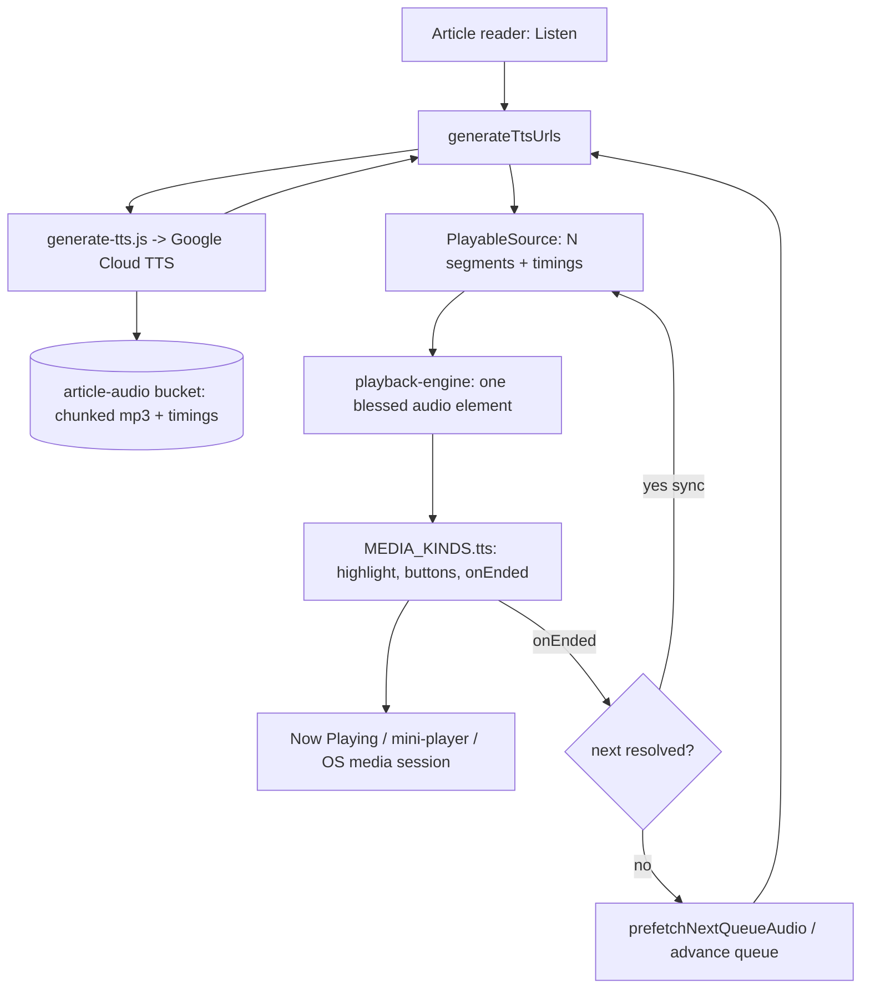
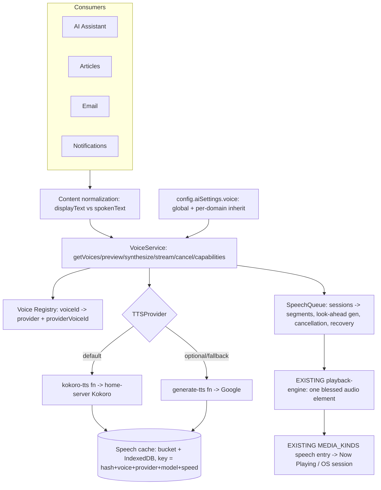

# Kokoro TTS + Unified AI Voice — Architecture & Design

*Read-only audit + design pass. No application code, schema, config, or infra was modified; nothing was committed. Evidence cited as `file:function` / `file:line`. `/design` is **not** a registered skill in this environment, so this is the equivalent design deliverable (a visual Settings mockup can be produced as a published artifact on request). Implementation has NOT begun — this is for review against the codebase first (§33).*

---

## 0. The reframe (read this first)

**This is not a greenfield TTS build. Speech is already shared media infrastructure in this app — it is just single-provider, single-voice, and article-only.** The most important finding of the audit is that the brief's core principle is *already largely realized*:

- `playback-engine.js` is a **type-agnostic, segment-based engine** whose docstring literally says *"article text-to-speech is an N-segment source… multi-chunk TTS and single-file media flow through the identical code path."* It owns **one persistent, gesture-unlocked `<audio>` element reused across segments and sources** — the hard-won iOS/background-playback behavior.
- `MEDIA_KINDS` (`app.js:43630`) is a one-entry-per-type dispatch table, and **`tts` is already an entry** alongside podcast/radio/music; `NOW_PLAYING_ORDER` includes it. TTS already integrates with Now Playing, the mini-player, and the OS media session.
- `generate-tts.js` already **chunks** articles, **caches** audio in a Supabase **`article-audio`** bucket, and returns **per-word timings for on-screen highlighting**.
- `prefetchNextQueueAudio` + `ttsResolvedUrls` + `beginNextResolvedArticleSync` (`app.js:~46890`) already do **cross-article look-ahead generation and a *synchronous* hand-off** (so the next article starts inside the `ended` handler, which iOS requires when backgrounded).

So the work is **generalize + consolidate**, not rebuild:

1. **Provider & voice abstraction** — today the only "provider" is Google Cloud TTS, hardwired in `generate-tts.js`, one voice, cache keyed by `articleId` only. Introduce a **Voice Registry** (`voiceId → provider → providerVoiceId`), a **VoiceService**, a **TTSProvider contract**, and **Kokoro as the default provider** (Google demoted to an optional/fallback provider). *(Bonus: Kokoro on your own server means private text stops going to Google — a real privacy upgrade, §26.)*
2. **Preference model** — a centralized AI Voice preference (global default + per-domain inherit) in the existing `config.aiSettings`.
3. **Consolidate the reliability-critical sprawl** — the article read-aloud state currently lives across ~8 module globals (`listenArticle`, `listenAllUrls`, `listenChunkIdx`, `listenNextAudio`, `ttsPrefetchCache`, `ttsResolvedUrls`, `mediaAllQueueRest`, `listenSpeaking`…). Fold these into an explicit **SpeechQueue / SpeechSession / SpeechSegment** model with **cancellation tokens** and **error-recovery policy** — this is what fixes the article→article edge cases without inventing new playback.
4. **Generalize consumers** — extend from article-only to **assistant / email / notifications**, all producing speech through the same VoiceService + engine.
5. **Settings → AI → Voice** — replace the lone `google_tts` on/off toggle with a polished voice browser + speed + per-feature overrides.

**Kokoro is an implementation detail. Voice is the product capability. Speech playback is the shared media infrastructure — which already exists and must be preserved, not duplicated.**

---

## 1. Current Architecture Audit

| Concern | Where it lives today | Verdict |
|---|---|---|
| **Shared audio engine** | `playback-engine.js` `createPlaybackEngine` — segment-based, one blessed `<audio>`, gapless hand-off, `setSegmentDuration`, `stop()` detaches handlers | **Keep. This is the foundation.** |
| **Per-kind behavior** | `MEDIA_KINDS` table (`app.js:43630`); `tts` entry drives highlighting, listen buttons, `onListenArticleFinished` | **Keep + extend** (add a general "speech" consumer path) |
| **MEDIA_KIND enum** | `media-model.js` `MEDIA_KIND` = video/music/podcast/radio/**article** (no formal "speech") | Add a canonical **`speech`** notion (article is one *source* of speech) |
| **Now Playing / OS session** | `MEDIA_KINDS[*].info()`, `setMediaSessionPlaybackState`, mini-player | **Reuse.** Speech items expose title/source/artwork/progress already |
| **TTS generation** | `generate-tts.js` → **Google Cloud TTS**, SSML `<mark>` word timings, chunked, cache in `article-audio` bucket, `FORMAT_VERSION` | **Generalize** behind a provider; keep as one provider |
| **Article generation entry** | `generateTtsUrls(article)` (`app.js:46865`) — builds intro + body, calls `generate-tts`, returns urls+timings+introWords | Becomes a VoiceService call for a "speech source" |
| **Look-ahead / transitions** | `prefetchNextQueueAudio`, `ttsPrefetchCache`, `ttsResolvedUrls`, `beginNextResolvedArticleSync`, `onListenArticleFinished` | **Consolidate** into an explicit queue/session |
| **Playback speed** | `SPEED_SELECT_IDS`, `setMediaPlaybackSpeed` → `engine.setRate` (playback-rate, not regen) | **Reuse** — speed is a playback concern here; no regen needed |
| **Word highlighting** | `highlightCurrentWord`, `.tts-word`/`.tts-word--active`, timings passthrough on `PlayableSource` | **Keep** — a differentiator (§24 segment/word highlighting already exists) |
| **Assistant** | `aiChatPanel` (index.html) + `chat.js` netlify function; voice-command via `voice-command.js` | New **consumer**; verify streaming for TTFA (§16) |
| **Preferences home** | `config.aiSettings` (`= {dailyBriefingEnabled}`), household-scoped synced section | Add `aiSettings.voice` here |
| **Persistence / caching** | Sectioned state + Supabase Storage buckets (`article-audio`, `cadence-blobs`, …) + IndexedDB (music/cadence) + the **content-store pattern we just designed** (`MEDIA_STATE_SPLIT_DESIGN.md`) | **Reuse** the content-store for speech-audio caching |
| **Mobile/background** | One blessed `<audio>` + sync hand-off inside `ended` = backgrounding works today | **Preserve carefully** — do not regress this |
| **Service worker** | `sw.js` — app shell; **bypasses audio content-types and data hosts** (never caches audio) | Speech-audio caching is app-layer (bucket/IndexedDB), not SW |
| **Tests** | `test/playback-engine.test.js`, media-* tests; **no tests around article TTS orchestration, transitions, or cache identity** | **Biggest gap** — orchestration is untested |

**Documented shortcomings that block clean generalization (smallest fixes proposed):**
1. **No provider seam.** Google is hardwired in `generate-tts.js`; the client calls it directly. → Introduce `TTSProvider` + a routing function so `generate-tts` (Google) and a new `kokoro-tts` proxy are interchangeable.
2. **Cache identity is `articleId` + `FORMAT_VERSION` only** — safe with one voice, **wrong the moment there are multiple voices/speeds**. → Extend the cache key (§9/§17).
3. **Orchestration is implicit** (module globals, no session object, ad-hoc cancellation). → SpeechSession/queue (§8/§12).
4. **TTS is article-shaped** (`generateTtsUrls` assumes an `article` with `.text`/`.title`). → A general `SpeechRequest { text, displayText?, meta, voiceId, source }` so assistant/email/notifications can produce speech too.

---

## 2. Existing Media / Playback Flow (today)


*Podcast/radio/music enter the same `ENG`/`MK` path via their own sources. The single engine + element is the shared spine.*

---

## 3. Proposed Speech Architecture


*Everything below `VoiceService` that touches playback is **existing** infrastructure. New pieces: content-normalization seam, VoiceService, Voice Registry, TTSProvider contract + Kokoro provider, the explicit SpeechQueue, the extended cache key, and the preference model.*

---

## 4. Data / Domain Model

New, small, provider-independent models (pure modules, testable):

```
Voice                      (registry entry — source of truth)
├── id            "bella"                 ← what the user & prefs reference
├── displayName   "Bella"
├── provider      "kokoro"
├── providerVoiceId "af_bella"            ← implementation detail, never in UI/prefs
├── language      "en-US"
├── accent        "American"
├── gender?/tags? metadata
├── previewSampleId?                      (optional pre-baked sample; else live)
└── availability  "available"|"degraded"|"unavailable"

SpeechRequest              (what a consumer asks to be spoken)
├── source        "assistant"|"article"|"email"|"notification"
├── refId         e.g. articleId / messageId / notifId (for cache + Now Playing)
├── spokenText    normalized text to synthesize
├── displayText?  what the UI shows (may differ — §15)
├── voiceId       resolved from prefs (§6)
├── speed         resolved from prefs
├── meta          { title, subtitle, artwork } for Now Playing
└── segmentsHint? optional pre-split (e.g. assistant sentence stream)

SpeechSegment              (one synthesizable/playable unit)
├── id            stable (parentId + index)
├── text          the chunk's spoken text
├── order
├── state         "queued"|"generating"|"ready"|"playing"|"failed"|"cancelled"
├── url?          resolved audio (bucket/IndexedDB/objectURL)
├── duration?     filled async (engine.setSegmentDuration)
├── timings?      optional word timings (highlighting)
├── retryCount
└── cacheKey      (§17)

SpeechSession              (a parent item = an article / a reply / an email)
├── id
├── request       the SpeechRequest
├── segments[]    ordered SpeechSegment
├── cursor        current segment index
├── genToken      cancellation/generation token (monotonic) — §13
└── status        "preparing"|"active"|"complete"|"failed"|"cancelled"

SpeechQueue                (ordered sessions — article A → B → C, or a reply)
├── sessions[]
├── activeSessionId
├── lookAhead     N segments / 1 next-session prefetch
└── policy        recovery + concurrency limits
```

`SpeechSession.segments[]` maps **directly** onto the engine's `PlayableSource.segments[]` — the engine already consumes exactly this. `timings` already ride through as the engine's opaque passthrough.

---

## 5. Voice Registry (§5)

A single module (`voice-registry.js`, pure/tested) is the source of truth. Kokoro's real voice inventory (Bella `af_bella`, Nicole `af_nicole`, Sarah `af_sarah`, Sky `af_sky`, Adam `am_adam`, Michael `am_michael`, …) is defined **once**, mapped to friendly ids. Google voices can be registered too (as `provider:"google"`) so the abstraction is proven with two providers from day one without new UI.

```
getVoices({provider?})  → Voice[]         (available, honest availability)
getVoice(voiceId)       → Voice | null
resolveProviderVoice(voiceId) → {provider, providerVoiceId}
```

The registry never scatters `af_bella` through the app; only the Kokoro provider ever sees it.

---

## 6. Voice Preference Model (§3)

Stored in the existing synced `config.aiSettings` (household-scoped) — **inherit, don't duplicate**:

```js
aiSettings.voice = {
  default:  { voiceId: "bella", speed: 1.0 },     // the one most users ever touch
  overrides: {                                     // omitted key = inherit default
    assistant:    null,        // null / absent = "Same as default"
    article:      null,
    email:        null,
    notification: null,
  },
  enabledFor: { assistant: true, article: true, email: true, notification: true }, // "Use AI voice for …"
}
```

Resolution: `voiceForDomain(domain) = overrides[domain]?.voiceId ?? default.voiceId` (same for speed). A pure `resolveVoicePrefs(aiSettings, domain)` function — trivially unit-testable (inheritance, override, missing keys). Migration: absent `aiSettings.voice` → defaults to `{default:{voiceId:"bella",speed:1.0}}`; the legacy `google_tts` on/off maps to `enabledFor.article`.

---

## 7. Provider Interface (§27) + Kokoro (§7)

```
TTSProvider
├── id                         "kokoro" | "google"
├── capabilities()             { streaming, wordTimings, speedAtGen, ssml, offline, maxChars }
├── listVoices()               provider's raw voices (registry maps to friendly ids)
├── synthesize(req) → { segments:[{url,duration?,timings?}] }   (whole-request, cached)
└── cancel(token)
```

- **Kokoro provider (default).** Client → **new session-gated `kokoro-tts` Netlify function** → **home-server Kokoro** → audio → cache in bucket → return URLs (mirrors `generate-tts`'s proven shape). The **home-server URL/credentials stay server-side** in the function (never in the client), exactly like other integrations. Kokoro supports word-level timing and speed; capabilities() advertises what it actually does.
- **Google provider (optional/fallback).** The existing `generate-tts.js` becomes `provider:"google"` behind the same contract — kept for redundancy, **off the private-content path by default** (see §26).
- **Deployment topology is a decision (see §16-risks / Open Questions).** Kokoro on a home box must be reachable by the cloud function — via a tunnel (Tailscale/Cloudflare) whose URL lives server-side — OR the client calls it directly on-LAN with the function as off-LAN fallback. The provider abstraction makes this swappable; recommend **function-proxied + tunnel** first (uniform across devices, secrets server-side).

---

## 8. Speech Queue Model (§10-13)

Consolidate today's globals into one `speech-queue.js` (pure orchestration, DOM-free, tested; it *emits* what to load and the app wires it to `mediaEngine.load`). Responsibilities:

- **Sessions in order** (article A→B→C, or a single assistant reply). Each session owns its segments and a **monotonically increasing `genToken`**.
- **Look-ahead generation:** keep the current segment playing while the next 1–2 segments (and the *next session's first segment*) are `generating`→`ready`. Generalizes the existing `prefetchNextQueueAudio`.
- **Synchronous hand-off preserved:** the next session's first segment URL must be resolvable **synchronously** at `ended` time (keep the `ttsResolvedUrls` idea, formalized) so backgrounded iOS keeps playing.
- **Cancellation (the race fix):** any queue mutation (skip/next/prev/stop/voice-change) **bumps `genToken`**; in-flight synthesis whose token is stale is **discarded on resolve** — it cannot set `url`, change Now Playing, move position, or resurrect audio. This is the single most important reliability primitive and is currently ad hoc.
- **Recovery policy (§14):** per-segment `retryCount` with backoff; classify errors (network/provider/timeout/invalid-text/cancelled/unavailable); on terminal failure **skip the segment or session per policy and continue** — a failed Article A never blocks Article B.

---

## 9. Caching Strategy (§17-18) — reuses the content-store design

**Extend the cache key** from `articleId`+`FORMAT_VERSION` to a content-addressed identity:

```
cacheKey = hash(spokenText) : voiceId : provider : modelVersion : speedIfGenApplied : lang
```

So *Article A + Bella* and *Article A + Nicole* are distinct; a model/format bump invalidates cleanly; **assistant/email/notification speech caches by text hash**, so identical phrases (e.g. a recurring notification) are synthesized once. If speed is applied at playback (engine rate — the current approach), speed is **excluded** from the key; only include it if a provider bakes speed into audio.

**Where audio lives** = the same two-tier content store from `MEDIA_STATE_SPLIT_DESIGN.md`: **Supabase Storage bucket** (durable, cross-device; today `article-audio`, generalize to a `speech-audio` bucket) + **IndexedDB** (local cache, offline, no repeat egress). Lifecycle (§18): **saved articles + recently-played = sticky**; everything else LRU-evictable from IndexedDB (re-pullable from the bucket); bounded total; orphan GC when a segment/session is deleted. This is the same eviction story we already committed to for article bodies — one policy, two content types.

---

## 10. Mobile / Runtime Strategy (§7-8, §20)

- **Background/lock-screen playback already works** via the single blessed element + sync hand-off — the design's job is **not to regress it** (any new orchestration must still drive `mediaEngine` and keep the next URL synchronously ready).
- **Home-server Kokoro is the default runtime** (privacy + quality); the VoiceService treats runtime as a provider capability, so **future local/device Kokoro** (WASM/ONNX) is *additive*: a new `TTSProvider("kokoro-local")` the registry can prefer when offline — **no changes** to consumers, Settings, queue, or Now Playing. **Do not** build a model-download system in phase 1; just don't assume "TTS ⇒ network" (offline reads served from the cache; local provider is a later phase).
- **Concurrency (§30):** the `kokoro-tts` function/home server must **bound concurrency + queue** (e.g. a small worker pool) so look-ahead prefetch can't spawn dozens of simultaneous jobs.

---

## 11. Settings UX (§2, §22, §23)

Location: **Settings → AI → Voice** (the context-settings dialog already hosts an AI/"general" area; add a "Voice" entry). Consumer-grade, provider details hidden:

```
AI Voice
────────────────────────────────
Voice            Bella            ›     ▶ Preview
Speaking speed   1.0×  [0.75 · 0.9 · 1.0 · 1.1 · 1.25 · 1.5 · 2.0]

Use AI voice for
  ⬤ Assistant     ⬤ Articles     ⬤ Email     ⬤ Notifications

Advanced ▾
  Article voice        Same as default  ›
  Assistant voice      Same as default  ›
  Email voice          Same as default  ›
  Notification voice   Same as default  ›
```

- **Voice picker** = a sheet listing registry voices grouped by language/accent, each `Bella · American English · ▶`. Selecting sets `aiSettings.voice.default.voiceId`.
- **Preview** and every per-voice ▶ go through **VoiceService.preview()** — the *same* provider path as real speech (no preview-only synth), and **starting a preview cancels the previous one** (shares the one blessed element; must not fight real playback — pause/stash any active session, or preview through a short-lived source and restore).
- **Overrides** collapsed under Advanced; each defaults to "Same as default," so the simple case stays one voice.
- Uses the app's existing dialog/toggle/segmented-control design language (`.std-form-dialog`, `.live-toggle`, the speed-select pattern).

*(I can render this as a published visual artifact for review if useful.)*

---

## 12. Article Playback Transition Strategy (§12) — the reliability fix

Root cause today: transition correctness depends on a web of globals and an implicit "is the next article resolved yet?" check; cold/uncached next articles, skips mid-generation, and voice changes have no unified cancellation, so playback can stall or a stale result can fire.

Target: **the SpeechQueue owns A→B→C as one continuous queue of sessions.**
- On play of A, immediately **prepare A's segments** *and* **prefetch B's first segment** (generation look-ahead), keeping B's first URL synchronously resolvable.
- A's `ended` → (sync) load B's ready first segment into the *same* engine/element (no destroy/recreate — already the case, but now guaranteed by the session model).
- **Skip/Next/Prev/Stop/voice-change** bumps `genToken`; stale in-flight synthesis is discarded; the queue re-prepares from the new cursor. No page component ever owns audio state.
- **Recovery:** if B fails to generate, retry→policy→skip to C, session marked failed, playback continues. Surface a quiet toast, not a dead player.

This removes the destroy/recreate and race surface entirely while **reusing** the engine and the sync-hand-off insight.

---

## 13. Testing Strategy (§28)

Pure modules make most of this unit-testable without a browser (the codebase's proven pattern):
- **Voice registry / prefs (pure):** id→provider resolution; `resolveVoicePrefs` inheritance/override/missing; availability; the `google_tts`→`enabledFor.article` migration.
- **Provider contract (fake provider):** synthesize/segment shape; capabilities; cancel; error classification; **cache-key identity** (same text+voice ⇒ hit; voice/model/speed change ⇒ distinct — a *contract test* like the media-search-scope one).
- **SpeechQueue (pure, fake clock/provider):** segment ordering; look-ahead; **A→B, A→B→C**; **skip during generation** (stale token discarded, no resurrection); pause during generation; voice/speed change while queued; provider failure → recover/skip; end-of-segment/session hand-off; the **synchronous next-URL** invariant.
- **Engine (existing `playback-engine.test.js`):** already covers segment advance/seek/rate with a fake element — extend for the queue's load pattern.
- **Regression (first-class, per §28):** the exact scenarios listed in the brief become named tests; the current article→article failure is the headline regression.
- **Browser/device QA (§29):** desktop light/dark, mobile viewport/touch, article + assistant playback, A→B transition, Settings selection + preview, pause/resume, **navigate-away-while-playing** — the boundary I cannot cross is **your logged-in real-data + real-device (iOS lock-screen) QA**, which I'll call out explicitly at every stage.

---

## 14. Implementation Phases (adjusted to the actual repo)

*Each phase is independently shippable, verified (build + tests + headless + fixtures), local-commit only, no push. Real-device/logged-in QA is yours.*

- **Phase 0 — Infra + provider seam (no user-visible change).** `voice-registry.js` + `resolveVoicePrefs` + `TTSProvider` contract + a routing shim; refactor `generate-tts` usage behind the contract as `provider:"google"`; extend the **cache key** (backward-compatible: old `article-audio` entries still resolve). Tests. *This is the smallest safe first step and unblocks everything.*
- **Phase 1 — Kokoro provider + home-server proxy.** `kokoro-tts` function (session-gated, server-side URL/creds, bounded concurrency); register Kokoro voices; VoiceService default = Kokoro. Behind a flag until validated. *(You provide the Kokoro endpoint; I'll give exact function + env setup.)*
- **Phase 2 — SpeechQueue/session consolidation.** Replace the article-TTS globals with the queue/session model + cancellation tokens + recovery, driving the **existing** engine. Ship the article→article reliability fix here. Heavy test focus.
- **Phase 3 — Settings → AI → Voice UX.** Voice browser, preview (via VoiceService), speed, `enabledFor`, Advanced overrides. Wire `aiSettings.voice` + migration.
- **Phase 4 — Consumers.** Assistant (stream→sentence-chunk→speak, low TTFA), email read-aloud, notifications — each a thin producer of a `SpeechRequest`.
- **Phase 5 — Later.** Local/offline Kokoro provider; observability polish; cache-lifecycle tuning. Only after the core is stable.

---

## 15. Files That Will Change / Be Created

**New (pure/small, testable):**
- `voice-registry.js`, `voice-prefs.js` (`resolveVoicePrefs`), `voice-service.js`, `tts-provider.js` (contract + `createKokoroProvider`, `createGoogleProvider`), `speech-queue.js`, `speech-text.js` (normalization / `displayText` vs `spokenText`), `speech-cache.js` (key + content-store glue).
- `netlify/functions/kokoro-tts.js` (session-gated proxy to home-server Kokoro).
- `test/voice-*.test.js`, `test/tts-provider.test.js`, `test/speech-queue.test.js`, `test/speech-cache.test.js`.

**Changed:**
- `app.js` — swap the article-TTS globals/`generateTtsUrls`/`onListenArticleFinished`/`prefetchNextQueueAudio` for the queue; add the `MEDIA_KINDS` "speech" wiring generalization; Settings → AI → Voice rendering; assistant/email/notification producers; `config` defaults/normalize/merge for `aiSettings.voice`.
- `netlify/functions/generate-tts.js` — conform to the provider contract (Google provider); no rewrite.
- `index.html` — Settings Voice UI markup; assistant "speak" affordance if needed.
- `styles.css` — voice picker / preview / speed controls (existing design language).
- `netlify.toml` — `kokoro-tts` function config (+ `included_files` if it imports shared parsers).
- *(Infra, yours)* a `speech-audio` bucket + RLS (or reuse/generalize `article-audio`), and the Kokoro endpoint/tunnel.

**Explicitly NOT changed:** `playback-engine.js` (the engine is already right), the podcast/radio/music kinds, Now Playing/OS-session core, the service worker's audio-bypass.

---

## 16. Risks, Migration & Open Questions

| Risk / question | Severity | Mitigation / needed decision |
|---|---|---|
| **Regressing iOS background/lock-screen playback** | High | The single-blessed-element + synchronous next-URL invariant must survive the refactor; make it an explicit tested invariant; device-QA gate. |
| **Kokoro reachability from the cloud function** (home box behind NAT) | High (decision) | **Open question:** tunnel-exposed Kokoro proxied by `kokoro-tts` (recommended) vs. direct on-LAN client call with function fallback. You choose the topology; abstraction makes it swappable. |
| **Cache-key change orphaning `article-audio`** | Med | New key is additive; keep resolving legacy `articleId` entries during a transition; GC later. |
| **Privacy — private text to a provider** | High | Default = Kokoro on *your* infra (no third party). Google stays **opt-in** and off the email/assistant path by default; VoiceService enforces the provider-per-domain privacy boundary (§26). |
| **Concurrency exhaustion on the Kokoro box** | Med | Bounded worker pool + queue in `kokoro-tts`/home server; look-ahead capped at 1–2 segments + 1 next-session. |
| **Assistant streaming may not exist** | Med | Verify `chat.js` streaming; if absent, chunk on sentence boundaries after response (still low-ish TTFA); streaming is a Phase-4 enhancement, not a blocker. |
| **Speed at gen vs playback** | Low | Keep speed as playback-rate (engine) → not in cache key, no regen; only bake in if a provider requires it. |
| **Scope creep into a "giant AI platform"** | Med | Ship the smallest thing per phase; consumers are thin `SpeechRequest` producers; no speculative providers. |
| **Migration of prefs** | Low | `google_tts` toggle → `enabledFor.article`; absent voice prefs → Bella default; all backward-compatible. |

---

## "If This Were My Codebase"

**Do First:** **Phase 0 — the provider/voice seam + cache-key fix** (`voice-registry`, `resolveVoicePrefs`, `TTSProvider`, route the existing Google generator behind it, extend the cache key). It's small, invisible to users, fully unit-testable, and unblocks Kokoro and multi-voice without touching playback. **Then Phase 1 (Kokoro proxy)** so the default voice becomes yours-and-private.

**Do Next:** **Phase 2 — the SpeechQueue consolidation**, because that's what actually fixes the article→article reliability problem (cancellation tokens + recovery + one session model over the existing engine). Then **Phase 3 (Settings UX)** and **Phase 4 (assistant/email/notifications)**.

**Avoid:** a second audio player or Now Playing (both exist and are good); scattering `af_bella`-style ids; letting article components own playback state; keying cache by article id; sending private text to Google by default; building a mobile model-download system now; a speculative multi-provider platform.

**Preserve:** `playback-engine.js` and its single-blessed-element/sync-hand-off, `MEDIA_KINDS`, Now Playing/OS-session, word-timing highlighting, the content-store/bucket caching pattern, and the CI/test discipline.

**Expected Outcome:** the app gains a **native, private voice** — pick Bella in Settings, preview instantly, hear the assistant, listen to articles that flow A→B→C with no gap or race, control speed, resume later, replay without re-synthesis, and use one voice everywhere (with optional per-feature overrides) — on a **general speech-infrastructure layer** where Kokoro is just the first provider and future local/offline Kokoro is additive.

---

## Definition of Success — mapped to the design

Every item in the brief's §34 is satisfied by the design above without a second player: Settings→pick→preview (Voice Registry + VoiceService + §11), assistant/article/email/notification speech (consumers → VoiceService → engine), background/navigate-away playback (existing blessed element — preserved), gapless A→B (SpeechQueue), speed (engine rate + prefs), resume (engine startPosition + progress), replay-without-regen (extended cache), one-voice-everywhere-with-overrides (prefs inheritance), and future local Kokoro (additive provider). **Kokoro is the implementation detail; voice is the capability; playback is the shared infrastructure — which already exists and is preserved.**

---

*Prepared read-only; nothing implemented or committed. `/design` is not registered here — this is the equivalent written design (visual Settings mockup available as an artifact on request). Items needing your input are flagged in §16 (chiefly the Kokoro deployment topology) and the real-device/lock-screen + logged-in QA that only you can run.*
